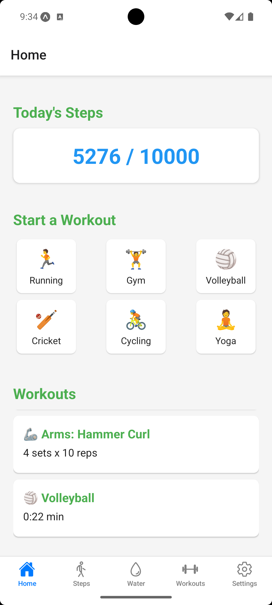
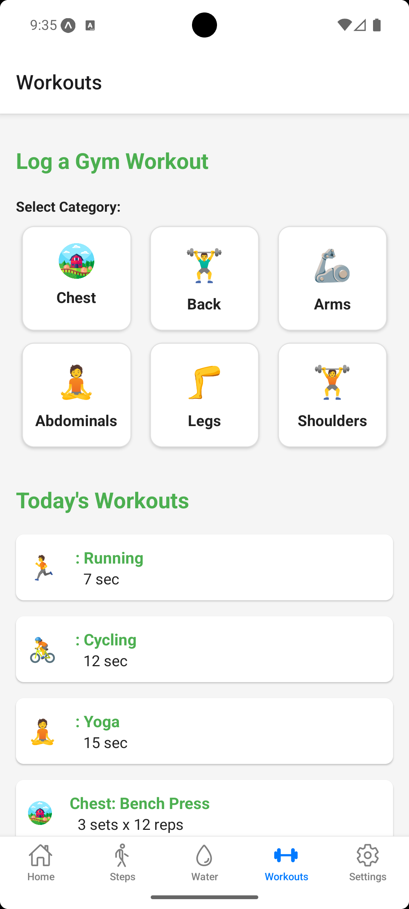
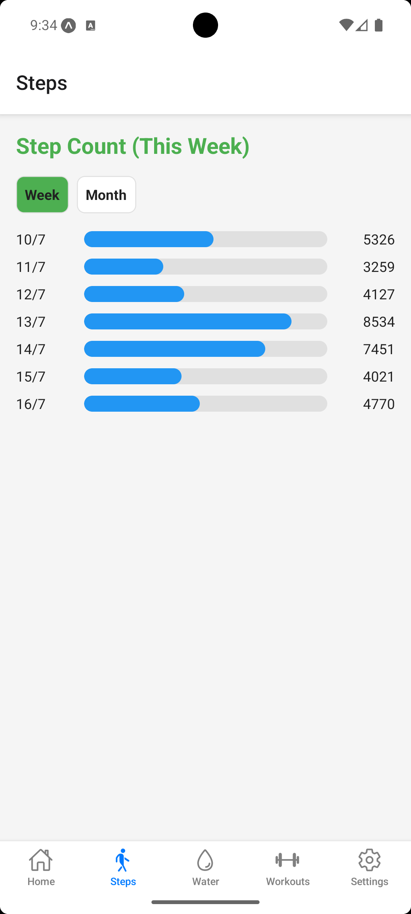
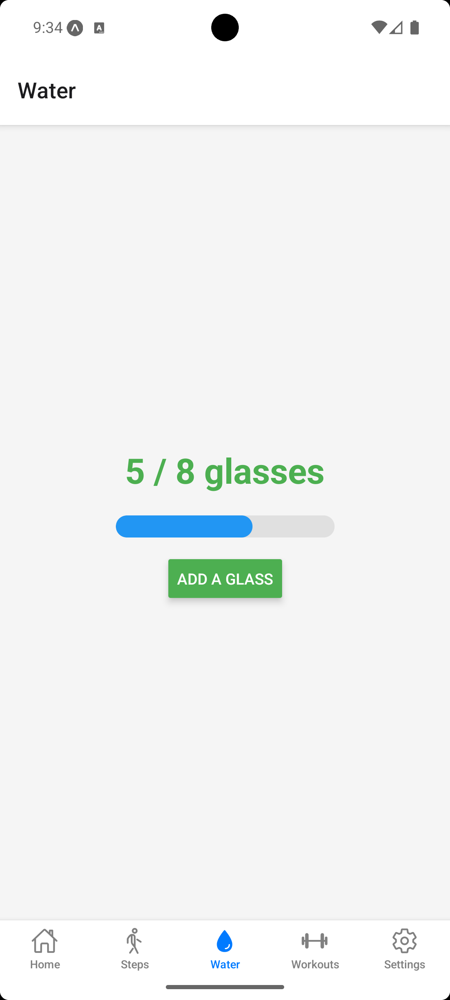
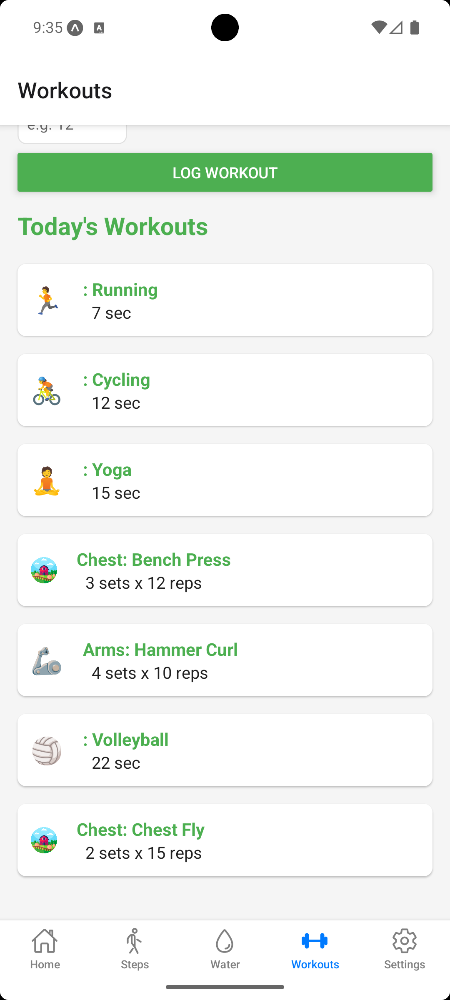
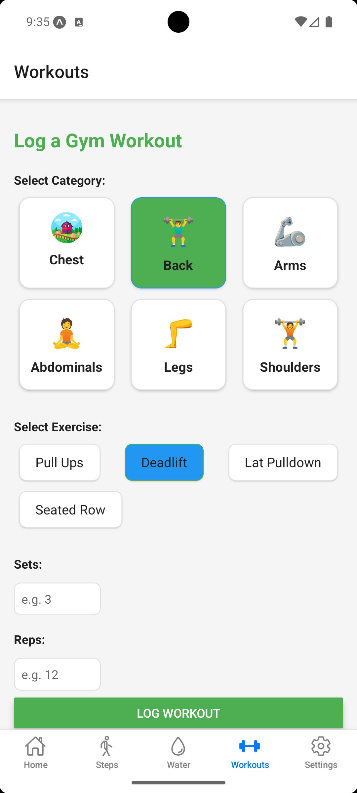
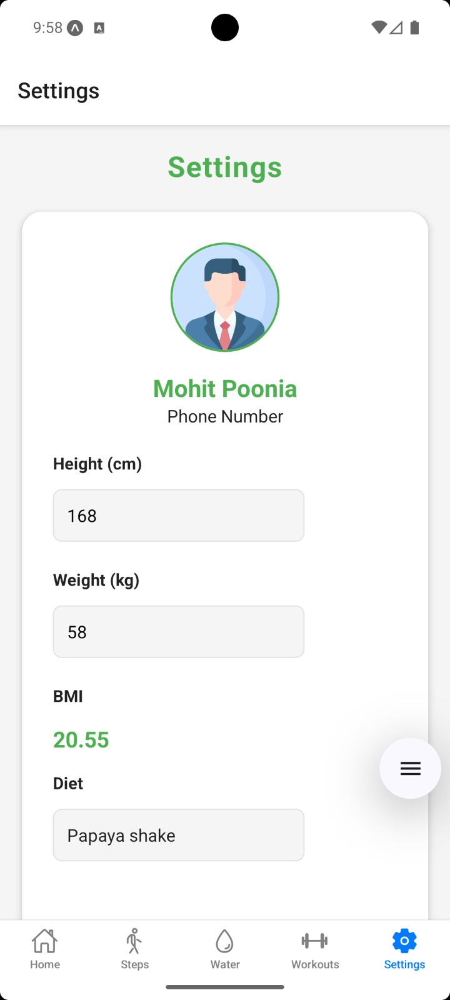
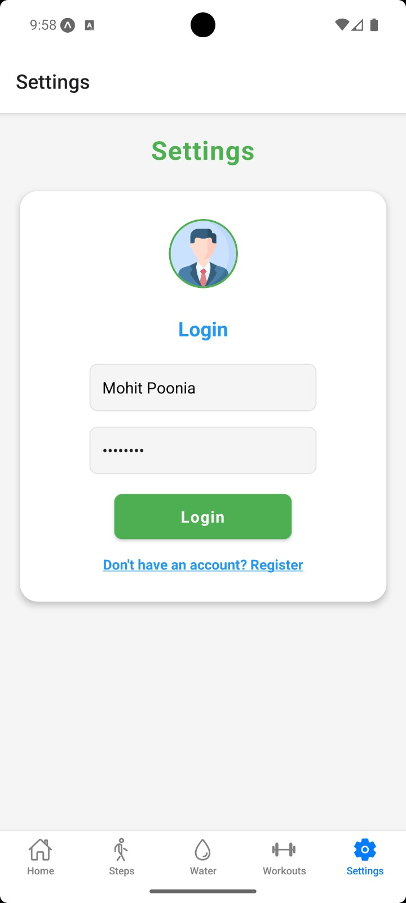
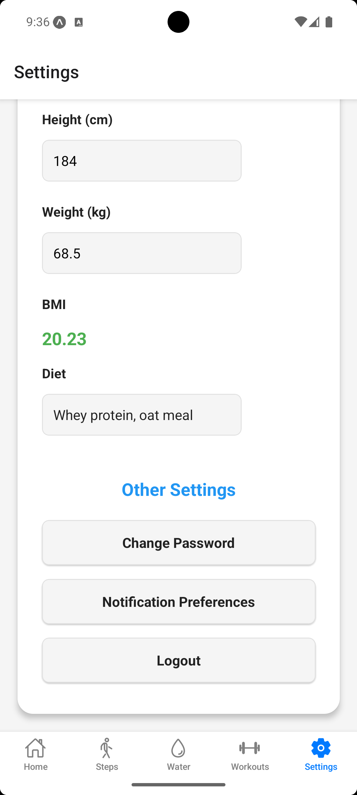

# FitnessTrackerApp

A comprehensive fitness tracking application to help you monitor your workouts, steps, water intake, and more.

## Features
- Track daily workouts
- Monitor step count
- Log water intake
- Manage your profile and settings

## Screenshots

### Home Page

### Workout Page

### Steps Page

### Water Intake Page

### Today's Workouts

### Log Workout

### Profile

### Settings

### Change Password

---

## App Icons

---

## Getting Started

1. Clone the repository
2. Install dependencies
3. Run the app on your preferred device/emulator

---

## License

This project is licensed under the MIT License. 